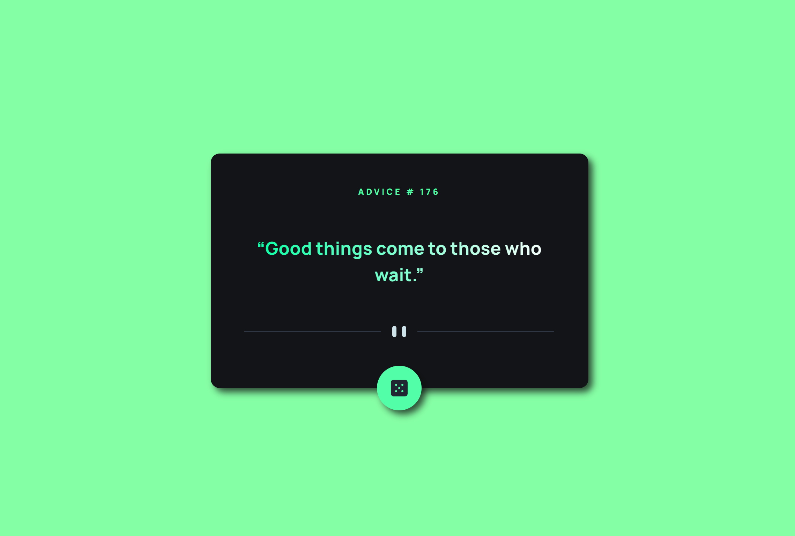

# Advice Generator App 💚

- View the optimal layout for the app depending on their device's screen size
- See hover states for all interactive elements on the page
- Generate a new piece of advice by clicking the dice icon

## Links

- Solution URL: [https://github.com/eigdoyr/advice-generator-app](https://github.com/eigdoyr/nft-preview-card)
- Live Site URL: [https://eigdoyr-advice-generator-app.netlify.com](https://eigdoyr-nft-preview-card.netlify.com)

## Built with

- [Vue](https://vuejs.org/)JS
- Vite
- Axios
- Advice Slip API
- Semantic HTML5 markup
- CSS custom properties
- Flexbox
- CSS Grid
- Mobile-first workflow
